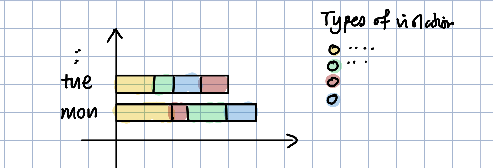
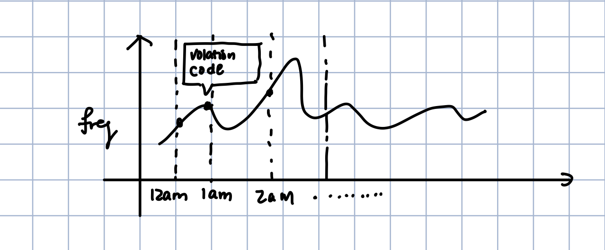
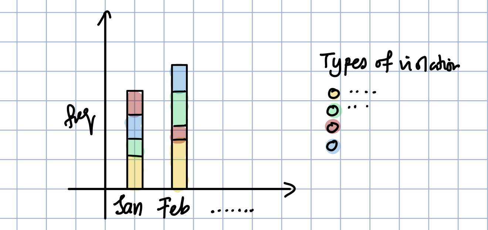

# NYC Parking Violation 2020 

Questions: 
1. What are the top 10 violation for 2020? 
    - [x] Plot Top 10 of violation in 2020 
    - [x] Get Top 10 of violation in 2019 
        - this is because I want to compare how pandemic effect the parking violation since everyone is staying at home and does not drive
        - Did the numbers go down? Which violation is higher because of the pandemic? 
2. When are tickets most likely to be issued? Any Seasonality?  
    - [x] Day of the weeks: Which day has a highest number of violation? 
        - ***Type of Graph*** : Stacked Horizontal bar chart
        - X-axis: Day of the week(Mon, Tue, Wed ...)
        - Y-axis: The top 5 violation of each days 
        - **This might not work since each day has different violation, might mess up with the number of indicators in the legend**
        
    - [x] Hrs of the Day: each hours which viololation is the highest
        -  ***Type of Graph*** : Line Chart with data points 
        - X-axis: Hours of the day(through out the year 2020)
        - Y-axis: The top 1 violation frequency 
        - tooltip: hover and see each dots what is the violation
        
    - [x] Months : Which months has the highest number of violation? Seasonal?
        - ***Type of Graph*** - Stacked Vertical bar chart
        - X-axis: Months of the year(Jan, Feb, Wed ...)
        - Y-axis: The top 5 violation of each months 
        
3. Where are the tickets most commonly issued? 
    - [ ] County 
        -  ***Type of Graph*** : Bar Chart with total violation 
        - X-axis: Top 10 county
        - Y-axis: number of violation for that county
4. What are the most common types of cars to be ticketed?
    - [ ] Vehicle Body Type(Sedan, etc)
    - [ ] Vehicle Make(Brand)
    - [ ] Plate Type
        - For each Plate type, what are the most violated? 
    - [ ] Registration State
5. Who are the common issuing agency?
    - [ ] issuing agency(police, etc)

